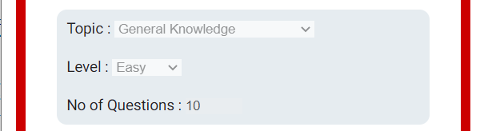

# Fun Online Quiz Game

This project is to build a fun Online Quiz game.
It should provide entertainment for it's audience. It targets all ages who like quizes.
This is a fully responsive quiz game that supplies as many questions as the user decides. It allows them to pick a level and a topic. 
It has a score tracking system that keeps track of the score as they go throuugh the questions and provides feedback after each question.
They can restart the game at any time if they choose to change the topic or level.
The game uses an API to get the requested number of questions and the categories available to be selected. https://opentdb.com

# Wireframes
I have used [Balsamic](https://balsamiq.com/wireframes/ "Balsamic") to develop some wireframes for my website. 

The wireframes are below:

### [Phone wireframe](docs/wireframes/Phone.png "Phone wireframe")
### [Tablet Wireframe](docs/wireframes/Tablet.png "Tablet wireframe")
### [Desktop Wireframe](docs/wireframes/Desktop.png "Desktop Wireframe")

## Features 

The site consists of a single page with a large heading, a preference area,  a score area, a question area and an answer & feedback area. 
It also has a button control to move to the next question. It also has a restart option.

### Existing Features

- __The Fun Quiz Heading__

  - Featured at the top of the page, the Fun Online Quiz Game heading is easy to see for the user and advertises immediately what the site is about. 
  - It also gives the page a 'fun' feel.

- __The Nav bar__
  - The Nav bar is an unordered list containing a single item. Restart.
  - Here it is clearly visible and always available to the player but it is also out of the way of the main button and doesn't interfere with the game.
  - It takes the player back to the Start page where the preferences are enabled and the player can re-pick.

- __The Prefences Area__

  - This section will allow the user select the topic, level and no of questions.These are disabled once the game is started. 
  - The options stack on top of each other on small screens like phones.

- __The Landing Area__

  - This section will display a message to encourage users to play and help them get started.

- __The Score Area__

  - This section will allow the user to see exactly how many correct and incorrect answers they have provided. 
  - The correct and incorrect scores stack on top of each other on small screens like phones.

- __The Game Area__

  - This section will allow the user to play the quiz game. The user will be presented with a question and potential answers. 

- __The Question section__

  - The question section is where the user will be presented with a single question at a time. 

- __The Answer section__

  - The answer section is where the user will be presented with a number of potential answers in a radio button format.
  - To answer they click one of the answers and click the 'Next Question' button. 
  - If they are incorrect a message will appear showing the result and the correct answwer. 
  - If they have reached the last question it will display the result  

- __The Incorrect Answer section__

  - The incorrect answer section appears when the wrong answer is selected and displays the right answer.

- __The Well Done section__

  - The well done section appears at the end and displays the score and a message.
  - If the player gets more than half the questions correct then the message says 'Well Done'. Otherwise it says 'Oh dear'.

- __The Button section__

  - The button in this section allows users to start the game, submit an answer or proceed to the next question. At the end they can choose to play another game.
  - The appropriate prompt will appear on the button as they progress.
  - If they get a question wrong then the button will display the text 'Next Queston'. If they get it right it will show 'Submit Answer'.

 

  

### Features Left to Implement

- Add another game like matching images.

## Technologies Used 

- HTML, CSS and Javacript

## Testing 

### Validator Testing 

- HTML
    - No errors were returned when passing through the official [W3C validator](https://validator.w3.org/nu/?doc=https%3A%2F%2Fevelynfoy.github.io%2Ffun-online-quiz-game%2F)
- CSS
    - No errors were found when passing through the official [(Jigsaw) validator](https://jigsaw.w3.org/css-validator/validator?uri=https%3A%2F%2Fevelynfoy.github.io%2Ffun-online-quiz-game%2F&profile=css3svg&usermedium=all&warning=1&vextwarning=&lang=en)
- JavaScript
    - No errors were found when passing through the official [Jshint validator](https://jshint.com/)
      - The following metrics were returned: 
      - There are 11 functions in this file.
      - Function with the largest signature takes 2 arguments, while the median is 0.
      - Largest function has 10 statements in it, while the median is 3.
      - The most complex function has a cyclomatic complexity value of 4 while the median is 2.

### Unfixed Bugs

You will need to mention unfixed bugs and why they were not fixed. This section should include shortcomings of the frameworks or technologies used. Although time can be a big variable to consider, paucity of time and difficulty understanding implementation is not a valid reason to leave bugs unfixed. 

## Deployment

I created a repository in github for this project https://github.com/evelynfoy/fun-online-quiz-game
I then used the gitpod editor to build it.

- The site was deployed to GitHub pages. The steps to deploy are as follows: 
  - In the GitHub repository, navigate to the Settings tab 
  - Then click the Pages tab.
  - From the source section drop-down menu, select the Master Branch
  - Once the master branch has been selected, the page will be automatically refresh with a link to the deployed site. 

The live link can be found here - https://evelynfoy.github.io/fun-online-quiz-game/

## Credits 

For code inspiration, help and advice,
* [Simen Daehlin](https://github.com/Eventyret "Simen Daehlin")
* [JavaScript Fetch API](https://www.javascripttutorial.net/javascript-fetch-API, "JavaScript Fetch API")

- The font I used was Roboto from Google Fonts [Roboto](https://fonts.google.com/?query=Roboto "Roboto") which I felt gave the game a clean and fun look.

### Content 

For content and style inspiration,

* [Free Astronomy Quiz](https://www.free-astronomy-quiz.com/index.html)
* [Open Trivia Database](https://opentdb.com)
* [Font Awesome](https://fontawesome.com/)

