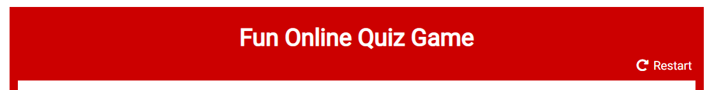
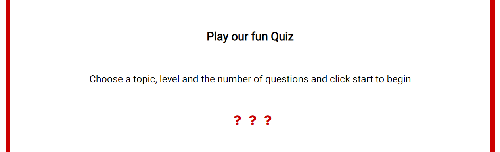
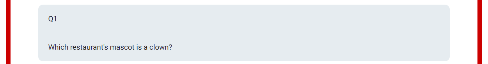

# Fun Online Quiz Game

This project is to build a fun Online Quiz game.
It should provide entertainment for it's audience. It targets all ages who like quizes.
This is a fully responsive quiz game that supplies as many questions as user decides. It allows them to pick a level and a topic . It has a score tracking system that keeps track of the score as they go throuugh the questions and provides feedback after each question.
They can restart the gane at any time if they choose to change the topic or level.

# Wireframes
I have used [Balsamic](https://balsamiq.com/wireframes/ "Balsamic") to develop some wireframes for my website. 

The wireframes are below:

### [Phone wireframe](docs/Phone.png "Phone wireframe")
### [Tablet Wireframe](docs/Tablet.png "Tablet wireframe")
### [Desktop Wireframe](docs/Desktop.png "Desktop Wireframe")

## Features 

The site consists of a single page with a large heading, a preference area,  a score area, a question area and an answer & feedback area. 
It also has a button control to move to the next question. 

### Existing Features

- __The Fun Quiz Heading__

  - Featured at the top of the page, the Fun Online Quiz Game heading is easy to see for the user and advertises immediately what the site is about. It also gives the page a 'fun' feel.

- __The Prefences Area__

  - This section will allow the user select the topic, level and no of questions.These can be changed at any time and the game re-started. 
  - The options stack on top of each other on small screens like phones.

- __The Landing Area__

  - This section will display a message to encourage users to play and help them get started.

- __The Score Area__

  - This section will allow the user to see exactly how many correct and incorrect answers they have provided. 
  - The correct and incorrect scores stack on top of each other on small screens like phones.

- __The Game Area__

  - This section will allow the user to play the quiz game. The user will be presented with a question and potential answers. 

- __The Question section__

  - The question section is where the user will be presented with a single question at a time. 

- __The Answer section__

  - The answer section is where the user will be presented with a number of potential answers in a radio button format.
  - To answer they click one of the answers and click the 'Next Question' button. 
  - If they are incorrect a message will appear showing the result and the correct answwer. 
  - If they have reached the last question it will display the result  

- __The Button section__

  - The button in this section allows users to start the game, proceed to the next question or re-start the game.
  - The appropriate prompt will appear on the button as they progress.

 

  

### Features Left to Implement

- Another feature idea

## Testing 

In this section, you need to convince the assessor that you have conducted enough testing to legitimately believe that the site works well. Essentially, in this part you will want to go over all of your project’s features and ensure that they all work as intended, with the project providing an easy and straightforward way for the users to achieve their goals.

In addition, you should mention in this section how your project looks and works on different browsers and screen sizes.

You should also mention in this section any interesting bugs or problems you discovered during your testing, even if you haven't addressed them yet.

If this section grows too long, you may want to split it off into a separate file and link to it from here.

### Validator Testing 

- HTML
    - No errors were returned when passing through the official [W3C validator](https://validator.w3.org/nu/?doc=https%3A%2F%2Fcode-institute-org.github.io%2Flove-maths%2F)
- CSS
    - No errors were found when passing through the official [(Jigsaw) validator](https://jigsaw.w3.org/css-validator/validator?uri=https%3A%2F%2Fvalidator.w3.org%2Fnu%2F%3Fdoc%3Dhttps%253A%252F%252Fcode-institute-org.github.io%252Flove-maths%252F&profile=css3svg&usermedium=all&warning=1&vextwarning=&lang=en)
- JavaScript
    - No errors were found when passing through the official [Jshint validator](https://jshint.com/)
      - The following metrics were returned: 
      - There are 11 functions in this file.
      - Function with the largest signature takes 2 arguments, while the median is 0.
      - Largest function has 10 statements in it, while the median is 3.
      - The most complex function has a cyclomatic complexity value of 4 while the median is 2.

### Unfixed Bugs

You will need to mention unfixed bugs and why they were not fixed. This section should include shortcomings of the frameworks or technologies used. Although time can be a big variable to consider, paucity of time and difficulty understanding implementation is not a valid reason to leave bugs unfixed. 

## Deployment

This section should describe the process you went through to deploy the project to a hosting platform (e.g. GitHub) 

- The site was deployed to GitHub pages. The steps to deploy are as follows: 
  - In the GitHub repository, navigate to the Settings tab 
  - From the source section drop-down menu, select the Master Branch
  - Once the master branch has been selected, the page will be automatically refreshed with a detailed ribbon display to indicate the successful deployment. 

The live link can be found here - https://code-institute-org.github.io/love-maths/

## Credits 

In this section you need to reference where you got your content, media and extra help from. It is common practice to use code from other repositories and tutorials, however, it is important to be very specific about these sources to avoid plagiarism. 

You can break the credits section up into Content and Media, depending on what you have included in your project. 

### Content 

- The text for the Home page was taken from Wikipedia Article A
- Instructions on how to implement form validation on the Sign Up page was taken from [Specific YouTube Tutorial](https://www.youtube.com/)
- The icons in the footer were taken from [Font Awesome](https://fontawesome.com/)

### Media

- The photos used on the home and sign up page are from This Open Source site
- The images used for the gallery page were taken from this other open source site

